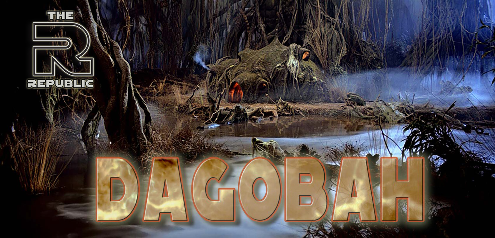

###############
DAGOBAH CHARTER
###############

Mission
=======

To develop a guild stationed on the purest and swampiest of planets within the Force, to focus on maximizing member progression through consistent raiding and a strong focus on Territory Battles, and to create a friendly and inviting environment with a focus on positivity and empowerment through teamwork and cooperation. 

Key Information
===============

Guild Reset
    8:30pm EST/1:30am GMT/5:30pm PST

Raid Times (rotating)
    10pm EST/3am GMT/7pm PST

    4pm EST/9pm GMT/1pm PST

Tickets Due (1 hour before reset)
    7:30pm EST/12:30am GMT/4:30pm PST

Officers
========

Guild Leader: zig
    The GL leads the officer corps and represents Dagobah in the Small Council. In addition, the GL arranges player transfers, interviews prospects, chairs guild meetings, and is responsible for the overall success of the guild.

Community Relations Officer: Pone
    The CRO focuses primarily on maintaining close ties with other Republic guilds and representing Dagobah in the Large Council. Like the GL, the CRO also arranges player transfers, interviews prospects, and serves as guild leader *pro tempore* in the event of the guild leader's absence.

Game Ops Team: Pone, Calliope, Brush Leonidas
    The Game Ops officers take point on TB, TW, and Raids. They're responsible for maintaining the raid schedule, the overall Territory Battle strategy, platoon orders, and Territory Wars defense/attack plans. They're also responsible for assigning raid, CM, platoon, deployment, and TW strikes as required.

Morale and Compliance Team: Energi Storm, Chocolate, NooGenii, Escobar
    The Morale and Compliance officers drive Dagobah's Discord activity and sense of community. They're responsible for coordinating ticket tracking efforts, arranging alts when required, tracking player development, generating media for the Swamp Street Journal, and assigning the ``@🐉Dagobah Dragonsnakes🐍`` tag to members that meet the monthly farming goal. They're also responsible for assigning ticket strikes, arranging roster reviews, running various guild promotions, and driving the conversation in ``#dagobah_chat``.

Recruiting Team: zig, Pone, Calliope, NooGenii
    Dagobah's recruiters are responsible for coordinating with other Republic recruiters on The Republic Embassy server. This includes doing first round interview with prospects, reaching out to competitive players via shard chats, the EA forums, and Reddit, and bumping Republic posts on those outlets.

General Rules
=============

Discord
-------
You must be active on Discord on a daily basis.
The officers use this resource to commuicate important information, including TB orders, TW plans, and Raid announcements.
Furthermore, as part of the Republic, you have access to some of the greatest theorycrafting minds in the game.
We're a home to Game Changers and other tremendous content content creators.
Ask questions in the SWGOH Game Chat category of the server and you'll get answers from experienced pros.
Utilizing these resources demonstrates a drive to improve your gameplay, so we take it very seriously.

swgoh.gg
--------
All members must have a **public** swgoh.gg profile. 
Our leadership resources make use of data fetched from these profiles.
It is one of our best tools for tracking roster progression and planning Territory Battles.
It is imperative that all members make their roster public. 
(If you require assistance with this, please contact a Morale and Compliance officer immediately.)

Raid Tickets
------------
Raid rewards are essential to player development, therefore all members must generate the maximum of 600 tickets per day.
These tickets are due 1 hour before guild reset.
After that time, you are likely to be removed for an alt.
Members will not be removed for tickets during a Territory Battle, however strikes will still apply.

Raids
-----
Raids run on a tight schedule that maximizes our ticket utilization.
The schedule is maintained via a Google calendar.
You can find the link in the ``#0----dagobah----0`` channel.
Members are required to strictly adhere to both the schedule and the Rules of Engagement.
See the `Raid Rules of Engagement`_ for more information.

Territory Battles
-----------------
Dagobah's main focus for development is Territory Battles, so it's imperative that members participate fully and carefully follow orders.
Combat missions are required because they are the most efficient way to maximize our star count.
Platoon, deployment, and CM orders will be posted to the ``#dagobah_tb_orders`` channel.
See the `Territory Battles Rules of Engagement`_ for more information.

Territory Wars
--------------
Territory Wars is optional on Dagobah.
However, members that do join are required to participate.
See the `Territory Wars Rules of Engagement`_ for more information.

Strikes
-------
Dagobah uses a three strike system to determine if and when a member should be removed to make room for a new recruit. 
Individual strikes come with one additional penalty---the Biever avatar.
See `Justin Biever`_ for more information.
Reaching three strikes will prompt the officers to consider removing you from the guild.
The officers will do their best to help you find alternate placement if that situation arises.
The following actions earn a strike:

* failure to complete your 600 by 1 hour before reset

* failure to adhere to the `Rules of Engagement`_ for Raids, Territory Battles, or Territory Wars. Some examples include:

    * posting damage of any amount to either raid outside of designated times

    * assigning characters to platoons other than those marked safe in ``#dagobah_tb_orders``

    * failing to attempt CMs in any phase of TB

    * failing to follow a TW Plan of Attack/Defense

Strikes expire one month from the day of the offense.
Members cannot earn more than one strike per day.
Members cannot earn a TB strike in a phase where we've 3 starred all territories and filled all safe platoons.
If you cannot meet these requirements for any length of time, please post in ``#leave_of_absence`` tagging ``@DaOfficers``.

Justin Biever
-------------
Dagobah assigns the Biever avatar to members who receive a strike as a friendly and funny way to keep morale high and remind us all that everyone makes mistakes.
Changing you avatar is a show of good faith and your intention to live up to rules in the future.
Bievers expire 3 days after the date of the strike.
See the `#0----dagobah----0` channel for the most recent version of the infamous picture.

Decorum
-------
Common courtesy is an absolute requirement of membership in Dagobah.
Treat your other guild members kindly and support their farming efforts.
Treat your officers with respect.
They put in many hours of effort each week to keep Dagobah operating smoothly.
Keep it PG-13 in ``#dagobah_chat``.
We're a team---staying supportive keeps morale high and the gameplay fun!

@🐉Dagobah Dragonsnakes🐍
-------------------------
Every TB the Dagobah leadership will choose a farming goal to promote roster development that helps the entire guild.
Successful completion of the farming goal will earn a member the ``@🐉Dagobah Dragonsnakes🐍`` Discord tag until the next cycle.
Being a Dragonsnake gives you more than just bragging rights.
It also gives you a chance at an expert roster review!
Members with the tag will be chosen at random to receive these reviews whenever reviewers are available, so make sure to keep working toward these goals!

Rules of Engagement
===================

Raid Rules of Engagement
------------------------
* Raids opens for a roughly 24 hour 0 damage period immediately after launch.

* The free for all starts about 24 hours after launch.

* Wait 10 minutes past the scheduled completion time before posting any damage to either raid.

Territory Battles Rules of Engagement
-------------------------------------
* Follow all platoons orders.

* Attempt all Combat Missions---they're the best way to boost our score and earn stars.

* Deploy as directed on Discord.

Territory Wars Rules of Engagement
----------------------------------
* Follow the strategy as indicated on Discord.

* Deploy only defensive teams that meet the requirements described on Discord.

* Make a serious attempt at attacking. Contact the Game Ops team if you attempted to attack but lost all of your battles so we know you won't have any offensive banners earned.

Discord Map
===========

``#0----dagobah----0``
    Location of the charter, the raid schedule, the latest Biever avatar, and charter updates between revisions.

``#dagobah_announcements``
    Channel for announcements, orders, etc.

``#dagobah_chat``
    Channel for general chat.

``#dagobah_library``
    Theorycrafting resources and more for Dagobah members.

``#the_swamp_street_journal``
    Dagobah-specific media.

``#dagobah_tb_orders``
    All TB related orders can be found here.

``#dagobah_screenshots``
    Share your ally code, swgoh.gg link, and triumphant screenshots here!

FAQ
===

Q: What do I do if I can't make my 600 or participate for a while?

A: Make a post in ``#leave_of_absence`` tagging ``@DaOfficers``. 

Q: What do I do if I don't understand the posted orders?

A: Tag ``@DaOfficers`` or the Game Ops team in ``#dagobah_chat``.

Q: I was removed from the guild and missed out on raid rewards. What happened?

A: You probably missed your 600 for the day. Contact the Morale and Compliance team if you think there's been a mistake.
