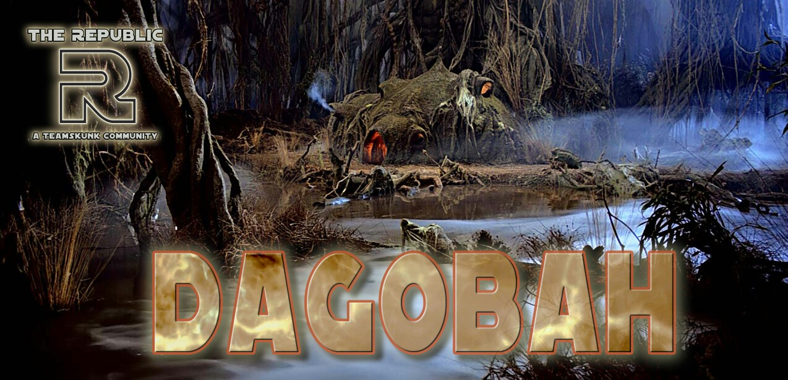
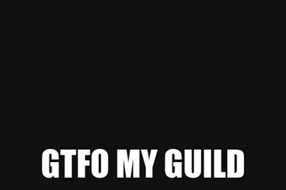

###############
DAGOBAH CHARTER
###############

Mission
=======

To develop a guild stationed on the purest and swampiest of planets within The Force, to focus on maximizing member progression through consistent raiding and a strong focus on Territory Battles, and to create a friendly and inviting environment with a focus on positivity and empowerment through cooperation. 

Key Information
===============

Guild Reset
    8:30pm EST/1:30am GMT/5:30pm PST

Raid Times (rotating)
    10pm EST/3am GMT/7pm PST

    4pm EST/9pm GMT/1pm PST

Tickets Due (2 hours before reset)
    6:30pm EST/11:30pm GMT/3:30pm PST

Officers
========

Guild Leader: zig
    Responsible for leading the officer corps, chairing guild meetings, and the overall success of the guild.

Community Relations Officer: (vacant)
    Responsible for maintaining close ties with other Republic guilds, arranging player transfers, acting as the guild leader's chief of staff, and serving as guild leader *pro tempore* in the event of the guild leader's absence.

Officer in Charge of Raids: beefstew
    Responsible for maintaining the raid schedule, raiding records, and assigning Bievers.

Officer in Charge of Territory Battles: Pone
    Responsible for the overall Territory Battle strategy, platoon orders, and assigning CM, platoon, and deployment strikes.

Officer in Charge of Territory Wars: (vacant)
    Responsible for Territory Wars defense/attack plans and assigning violation strikes.

Officer in Charge of Ticket Monitoring: Chocolate
    Responsible for coordinating who will be tracking tickets each day as well as approving alts and assigning ticket strikes.

Officer in Charge of Recruiting: Calliope
    Responsible for coordinating recruiting efforts with the GL and CRO on The Republic Embassy server, ensuring recruits are prepared to meet our standards, and providing invites and orientation to new recruits upon joining Dagobah.

Officer in Charge of Journalism and Morale: Energi Storm
    Responsible for tracking roster development, squad and fleet arena performance, generating morale boosting media and farming goals to promote high participation from guild members, and assigning the @🐍Dagobah Dragonsnakes🐍 tag each month to members that met the previous month's farming goals.

General Officers: Escobar, Adam3700
    Responsible for assisting other officers in their duties as needed, especially ticket monitoring.

General Rules
=============

Discord
-------
You must be active on Discord.
This is essential because all orders and announcements will be posted to Discord.
Furthermore, as part of the Republic, you have access to some of the greatest theorycrafting minds in the game.
Not utilizing those resources shows a lack of drive to improve your gameplay.

swgoh.gg
--------
All members must have a **public** swgoh.gg profile. 
Our leadership resources make use of data fetched from these profiles.
It is one of our best tools for tracking roster progression and planning Territory Battles.
It is imperative that all members make their roster public. 
(If you require assistance with this, please contact an officer immediately.)

Raid Tickets
------------
Raid rewards are essential to player development, therefore all members must generate the maximum of 600 tickets per day.
These tickets will be due 2 hours before guild reset.
After that time, you risk being removed for an alt.
Members will not be removed for tickets during a Territory Battle except in the event of a third strike.

Raids
-----
Raids run on a tight schedule that maximizes our ticket utilization.
You can find it in the #dagobah_raid_schedule channel.
Members are required to strictly adhere to both the schedule and the `Rules of Engagement`_.
Missing a raid entirely earns you the dreaded Biever avatar (see `Justin Biever`_).

Territory Battles
-----------------
Dagobah's main focus for development is Territory Battles, so it's imperative that members participate fully and carefully follow orders.
Combat missions are required because they are the most efficient way to maximize our star count.
Platoon orders will be posted to the #dagobah_tb_orders channel.
Deployment orders will be posted to the #dagobah_annoucements channel.
See the `Territory Battles Rules of Engagement`_ for more information.

Territory Wars
--------------
Territory Wars is optional on Dagobah.
However, members that do join are required to participate.
See the `Territory Wars Rules of Engagement`_ for more information.

Strikes
-------
Dagobah uses a three strike system to determine if and when a member should be removed to make room for a new recruit. 
Individual strikes come with no additional penalty, but reaching three strikes will result in removal from the guild.
The officers will do their best to help you find alternate placement if that situation arises.
The following actions earn a strike:

* failure to complete your 600 by 2 hours before reset

* failure to adhere to the `Rules of Engagement`_ for Raids, Territory Battles, or Territory Wars. Some examples include:

    * posting damage to either raid outside of designated times

    * assigning characters to platoons not marked safe in #dagobah_tb_orders

    * failing to attempt CMs in any phase of TB

    * failing to follow a TW Defense or Attack plan

Strikes expire one month from the day of the offense.
Members cannot earn more than one strike per day.
Members cannot earn a missed CMs strike in a TB phase where we've 3 starred all territories.
If you cannot meet these requirements for any length of time, please post in #leave_of_absence tagging @DaOfficers.

Justin Biever
-------------
As a means of boosting morale and participation, Dagobah assigns the Biever avatar to members who miss a raid entirely without giving prior notice in #leave_of_absence.
The Biever expires when the rewards drop for the next of the same raid type---two days for Rancor, three days for HAAT.
See below for the infamous picture.

Decorum
-------
Common courtesy is an absolute requirement of membership in Dagobah.
Treat your other guild members kindly and support their farming efforts.
Treat your officers with respect.
They put in many hours of effort each week to keep Dagobah operating smoothly.
Keep it PG-13 in #dagobah_chat.
Don't make us being the @👑Swamp King👑 into this...

Rules of Engagement
===================

Rancor Rules of Engagement
--------------------------
* Opens for a 24 hour 0 period immediately after launch.

* The free for all starts 24 hours after launch.

* Wait 20 minutes if posting more than 1 million damage.

HAAT Rules of Engagement
------------------------
* P1-3 are free for all immediately after launch.

* P4 opens 24 hours after launch.

* Wait 5 minutes if posting more than 25% of P4.

Territory Battles Rules of Engagement
-------------------------------------
* Follow all platoons orders.

* Attempt all Combat Missions.

* Deploy as directed.

Territory Wars Rules of Engagement
----------------------------------
* Follow the strategy as indicated on Discord.

* Deploy at least 3 defensive squads and 1 defensive fleet. These can be exclusively junk squads as long as they're in the right zones.

* Deploy only teams meeting the minimum requirements described on Discord.

* Make a serious attempt at attacking. Contact @DaOfficers if you attempted to attack but lost all of your battles so we're aware you won't have any offensive banners earned.

Discord Map
===========

#0----dagobah----0
    Location of the charter, Biever avatar, and charter updates between revisions.

#dagobah_announcements
    Channel for officer announcements and orders.

#dagobah_chat
    Channel for general chat.

#dagobah_library
    Theorycrafting resources and more for Dagobah members.

#the_swamp_street_journal
    Dagobah-specific media.

#dagobah_tb_orders
    Bot-only channel for platoon orders.

#dagobah_ally_codes
    Share your ally code and swgoh.gg page here!

#dagobah_screenshots
    Channel for activity tracking via screenshots.

#dagobah_raid_schedule
    Channel for the raid calendar. The Discord post is official.

FAQ
===

Q: What do I do if I can't make my 600 or participate for a while?

A: Make a post in #leave_of_absence tagging @DaOfficers. 

Q: What do I do if I don't understand the orders for TB/TW?

A: Tag @DaOfficers or the relevant Officer in Charge in #dagobah_chat.

Q: I was removed from the guild and missed out on raid rewards. What happened?

A: You probably missed your 600 for the day. Contact the OiC of Ticket Monitoring if you think there's been a mistake.

Q: I was removed from the guild after reset and I know I got my 600. What gives?

A: Your lifetime ticket count was reset due to a missed 600 sometime during TB or a holiday grace period. Contact the OiC of Ticket Monitoring if you think there's been a mistake.
